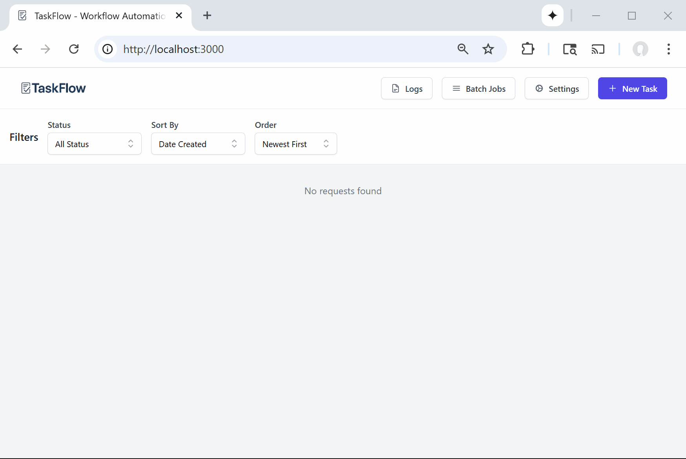

# TaskFlow - Local AI Workflow Execution System

## Each task executes a workflow and gets an AI Analysis Dashboard


## Easily create simple workflows and dashboards with structured outputs


Build complex AI workflows visually, create custom dashboards, and process batches of tasks - all with a 100% local setup. Upload your tasks via CSV or Excel, experiment with different workflow designs in the intuitive drag-and-drop interface, and discover what works best for your use case.

**Perfect for**: Data enrichment, content analysis, bulk processing, research tasks, and any scenario where you need to experiment with AI transformations while keeping your data private. Easily deployable to Kubernetes for team collaboration.

## Key Features

- 🎨 **Visual Workflow Builder** - Drag-and-drop interface for creating complex AI pipelines
- 📊 **Custom AI Dashboards** - Build your own dashboards to visualize results and insights
- 🚀 **100% Local Processing** - All data stays on your machine or private cluster
- 📁 **Batch Task Processing** - Upload tasks via CSV or Excel files
- 🧪 **Experimentation Platform** - Quickly test different prompts and workflow designs
- 🎮 **GPU Acceleration** - Optional NVIDIA GPU support for faster processing
- ☸️ **Kubernetes Ready** - Production-ready K8s manifests for team deployments
- 🔄 **Flexible AI Models** - Use any Ollama-compatible model
- 📈 **Real-time Progress** - Track workflow execution with live updates

## Architecture

- **Frontend**: React 18 + TypeScript + TailwindCSS
- **Backend API**: FastAPI 0.111 + Python 3.12
- **AI Worker**: Python microservice with Ollama (default: gemma3:1b)
- **Database**: PostgreSQL 15+ for workflow and task storage with JSONB support
- **Deployment**: Docker Compose for local dev, Kubernetes for production

## Quick Start

### Prerequisites

**For Local Development:**
- Docker Desktop (with at least 4GB RAM allocated)
- Git
- 10GB+ free disk space for models
- (Recommended) NVIDIA GPU with CUDA support for 10x faster processing

**For Kubernetes Deployment:**
- Docker 26+
- Kubernetes 1.30+
- kubectl
- kustomize (optional, can use kubectl apply -k)

### Local Development

1. **Clone the repository**
   ```bash
   git clone https://github.com/jessiewbailey/TaskFlow.git
   cd TaskFlow
   ```

2. **Quick Setup (Recommended)**
   ```bash
   # Automated setup - creates secure passwords and starts all services
   ./scripts/setup-dev.sh
   ```

3. **Manual Setup**
   ```bash
   # Create environment file from example
   cp .env.example .env
   # Edit .env file to set your own passwords
   
   # Start all services (CPU mode)
   docker-compose up -d --build
   
   # OR start with GPU support (requires NVIDIA GPU)
   docker-compose -f docker-compose.gpu.yml up -d --build
   
   # Download AI model (first time only)
   docker-compose exec ollama ollama pull gemma3:1b
   ```
   
   For GPU setup instructions, see [GPU Setup Guide](docs/GPU_SETUP.md).

4. **Access the application**
   - Frontend: http://localhost:3000
   - API Documentation: http://localhost:8000/docs
   - API Health: http://localhost:8000/healthz


### Building Images

```bash
# Build backend API
docker build -t registry.local/taskflow-api:latest backend/

# Build AI worker
docker build -t registry.local/taskflow-ai:latest ai-worker/

# Build frontend
docker build -t registry.local/taskflow-web:latest frontend/
```

## Features

### Core Functionality

- **Visual Workflow Builder**: 
  - Intuitive drag-and-drop interface
  - Connect multiple AI processing blocks
  - See data flow in real-time
  - Test workflows on sample data before full execution
  
- **Custom AI Dashboards**:
  - Design your own analytics dashboards
  - Visualize workflow results with charts and graphs
  - Track performance metrics across runs
  - Export dashboard configurations

- **Workflow Blocks**: 
  - AI Processing blocks with customizable prompts
  - Input/Output mapping between blocks
  - Conditional logic and filtering
  - Template variables for dynamic processing
  
- **Batch Processing**:
  - Upload tasks via CSV or Excel
  - Execute workflows on hundreds of items
  - Real-time progress tracking
  - Export results in multiple formats
  
- **Experimentation Features**:
  - A/B test different prompts
  - Compare workflow variations
  - Track which approaches work best
  - Iterate quickly on your designs

## Getting Started

### 1. Upload Your Tasks

1. Navigate to http://localhost:3000
2. Click "Upload Tasks" and select your CSV or Excel file
3. Map your columns to task fields (title, description, metadata)

### 2. Design Your Workflow Visually

1. Open the **Visual Workflow Designer**
2. Drag AI Processing blocks from the palette onto the canvas
3. Configure each block by clicking and adding your prompts:
   ```
   Example: "Summarize the following task in 2 sentences: {{description}}"
   ```
4. Connect blocks by dragging from output to input ports
5. Test your workflow on a sample task
6. Save your workflow for reuse

### 3. Build Custom Dashboards

1. Go to **Dashboard Builder**
2. Add visualization widgets (charts, tables, metrics)
3. Connect widgets to your workflow outputs
4. Customize the layout and styling
5. Save and share your dashboard configuration

### 4. Execute and Explore

1. Select your uploaded tasks
2. Choose a saved workflow
3. Click "Execute Workflow"
4. Watch real-time progress in your custom dashboard
5. Explore results and iterate on your workflow
6. Export results as CSV, Excel, or JSON

### Example Use Cases

- **Content Processing**: Build visual pipelines to summarize, categorize, and extract insights
- **Data Enrichment**: Create workflows that add classifications, sentiment, and entities
- **Research Analysis**: Design custom dashboards to explore patterns and generate reports
- **Quality Assurance**: Develop workflows to check compliance and accuracy at scale
- **Experimentation**: Rapidly test different AI approaches to find what works best

## Visual Workflow Builder

The drag-and-drop workflow builder makes it easy to create complex AI pipelines without coding:

### Features
- **Visual Canvas**: See your entire workflow at a glance
- **Block Library**: Pre-built AI processing blocks ready to use
- **Live Preview**: Test workflows on sample data before running
- **Connection Validation**: Ensures data flows correctly between blocks
- **Workflow Templates**: Start from pre-built templates or create your own

### Workflow Block Types
- **AI Processing**: Configure custom prompts with variable substitution
- **Data Transformation**: Reshape and filter data between steps
- **Conditional Logic**: Branch workflows based on AI outputs
- **Aggregation**: Combine results from multiple branches
- **Export Blocks**: Format output for different use cases

## Custom AI Dashboards

Build your own dashboards to visualize workflow results and track performance:

### Dashboard Components
- **Metrics Cards**: Display KPIs and summary statistics
- **Charts & Graphs**: Visualize trends and distributions
- **Data Tables**: Browse and filter detailed results
- **Progress Trackers**: Monitor batch processing in real-time
- **Export Widgets**: One-click data export options

### Dashboard Features
- **Drag-and-Drop Builder**: Arrange components visually
- **Auto-Refresh**: Live updates as workflows process
- **Responsive Design**: Works on desktop and mobile
- **Share & Export**: Save dashboard configurations
- **Custom Styling**: Match your organization's branding

### API Endpoints

| Endpoint | Method | Description |
|----------|--------|-------------|
| `/api/requests` | GET | List/filter tasks |
| `/api/requests` | POST | Upload new tasks |
| `/api/requests/bulk` | POST | Bulk upload from CSV/Excel |
| `/api/workflows` | GET/POST | Manage workflows |
| `/api/workflows/{id}/execute` | POST | Execute workflow on tasks |
| `/api/jobs/{job_id}` | GET | Get job status |
| `/api/jobs/{job_id}/stream` | GET | Stream job progress (SSE) |
| `/api/export` | POST | Export results |
| `/healthz` | GET | Health check |
| `/metrics` | GET | Prometheus metrics |

## Configuration

### Environment Variables

**Backend API:**
- `DATABASE_URL`: PostgreSQL connection string
- `AI_WORKER_URL`: AI worker service URL
- `SECRET_KEY`: JWT secret key
- `DEBUG`: Enable debug mode

**AI Worker:**
- `OLLAMA_HOST`: Ollama server URL
- `MODEL_NAME`: AI model name (default: gemma3:1b)
- `BACKEND_API_URL`: Backend API URL

**Frontend:**
- `VITE_API_BASE_URL`: Backend API base URL

### Database Schema

The application uses PostgreSQL 15+ with the following main tables:

- `requests`: Uploaded tasks and their metadata
- `workflows`: Saved workflow definitions
- `workflow_blocks`: Individual processing blocks in workflows
- `ai_outputs`: AI processing results
- `processing_jobs`: Async job tracking
- `users`: System users for multi-user environments

See `database/setup/schema.sql` for the complete schema.

## Development

### Project Structure

```
TaskFlow/
├── backend/           # FastAPI backend
│   ├── app/
│   │   ├── models/    # Database models
│   │   ├── routers/   # API endpoints
│   │   ├── services/  # Business logic
│   │   └── main.py    # Application entry point
│   └── Dockerfile
├── ai-worker/         # AI processing service
│   ├── ai_pipeline/   # AI processing logic
│   ├── worker.py      # Service entry point
│   └── Dockerfile
├── frontend/          # React frontend
│   ├── src/
│   │   ├── components/
│   │   ├── hooks/
│   │   ├── types/
│   │   └── api/
│   └── Dockerfile
├── database/          # Database schemas and migrations
│   ├── setup/         # Initial database schema
│   └── migrations/    # Database migration scripts
├── docs/              # Documentation
│   ├── QUICKSTART.md
│   ├── SECURITY.md
│   └── ...
├── config/            # Configuration files
├── scripts/          # Setup and utility scripts
└── test-files/       # Test data and examples
```

### Running Tests

```bash
# Backend tests
cd backend
pytest

# Frontend tests
cd frontend
npm test

# Integration tests
# TODO: Add integration test setup
```

### Development Workflow

```bash
# View all service logs
docker-compose logs -f

# View specific service logs
docker-compose logs -f taskflow-api

# Restart a service
docker-compose restart taskflow-api

# Stop all services
docker-compose down

# Stop and remove volumes (reset everything)
docker-compose down -v

# Check service status
docker-compose ps

# Execute commands in containers
docker-compose exec taskflow-api bash
docker-compose exec postgres psql -U taskflow_user -d taskflow_db
```

### Troubleshooting

**Services won't start:**
```bash
# Check logs
docker-compose logs -f [service-name]

# Common issues:
# - Port conflicts: Ensure ports 3000, 8000, 8001, 3306, 11434 are available
# - Memory: Ensure Docker has at least 4GB RAM allocated
```

**AI model issues:**
```bash
# Manual model download
docker-compose exec ollama ollama pull gemma2:2b

# Check Ollama logs
docker-compose logs ollama
```

**Database issues:**
```bash
# Check PostgreSQL logs
docker-compose logs postgres

# Reset database
docker-compose down -v
docker-compose up -d postgres
```

### Code Quality

```bash
# Backend linting
cd backend
black app/
isort app/
mypy app/

# Frontend linting
cd frontend
npm run lint
npm run typecheck
```
## Configuration

### UI Labels Customization

TaskFlow allows you to customize all UI labels and terminology to match your use case:

- **Task Terminology**: Customize whether you call them "tasks", "items", "records", etc.
- **Status Labels**: Define your own status names
- **Form Labels**: Customize all form field labels

To customize labels:

1. Edit `/config/ui-labels/labels.yaml`
2. Key fields for table headers:
   ```yaml
   dashboard:
     table:
       requester: "Submitter"  # Change to your preferred term
       analyst: "Assignee"     # Change to your preferred term
   ```
3. Restart the API service to apply changes

For detailed configuration instructions, see [docs/configuring-ui-labels.md](docs/configuring-ui-labels.md).

## Why TaskFlow?

- **Visual Development**: Build complex workflows without coding
- **Experimentation Platform**: Discover what works through rapid iteration
- **Privacy First**: Your data never leaves your infrastructure
- **Cost Effective**: No API fees or usage limits
- **Team Ready**: Deploy to Kubernetes for collaborative workflow development
- **Customizable**: Create any workflow, use any Ollama model
- **Fast**: GPU acceleration for processing large batches
- **Shareable**: Export workflows and dashboards to share with your team

## Security

- All processing happens locally - no external API calls
- Non-root containers with security contexts
- Generated secure passwords for all services
- Audit logging for compliance needs
- No telemetry or usage tracking

## Contributing

1. Fork the repository
2. Create a feature branch
3. Make your changes
4. Add tests
5. Submit a pull request

## Support

For issues and questions:
- Check the [docs](docs/) folder for guides
- Open an issue on GitHub
- See [QUICKSTART.md](docs/QUICKSTART.md) for detailed setup

## Roadmap

- [ ] Additional workflow block types (web scraping, API calls)
- [ ] Support for more file export formats (PDF, DOCX)